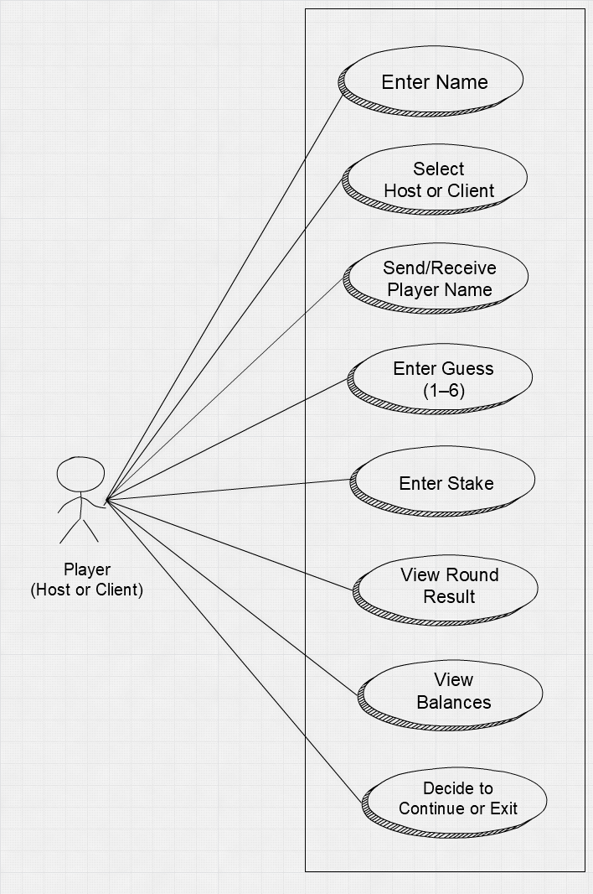

# Tutorial 1 - Player Class Definition

## **Introduction to Use-Case Diagram**

- A use-case diagram is a vital tool in software development that visually represents how users (known as actors) interact with a system to achieve specific goals or functionalities. 
- It captures the functional requirements of a system by illustrating the various use cases — or actions — that users can perform, along with the relationships between the users and those actions. 
- Use-case diagrams help developers, designers, and stakeholders understand what the system is expected to do from the user's perspective, ensuring clarity, communication, and proper feature planning early in the development lifecycle.

#### **Use-Case Diagram for the Player Class**

- The use-case diagram for the Player class is important because it clearly illustrates the specific interactions a player (the human user) has with the game system. 
- While the Player class in code holds data and behavior related to a single game participant, the use-case diagram shifts the perspective to show how a player uses the system — such as entering their name, choosing to host or join, placing a stake, making a guess, and deciding to continue or quit. 
- This diagram is essential for understanding how the player fits into the overall gameplay flow. It ensures that all necessary functionalities related to player interaction are identified and accounted for during design. 
- Moreover, it helps bridge the gap between technical implementation and user expectations, enabling developers to align system behavior with real-world use.

#### **Use-Case Diagram**

<div align="center">
  <br>
  <em>Figure: Use-Case Diagram for Player</em>
</div>

##### DESCRIPTION

| **Step**                       | **Description**                                              |
| ------------------------------ | ------------------------------------------------------------ |
| **Enter Name**                 | The player inputs their display name at the start of the game. |
| **Select Host or Client**      | The player decides whether to act as the server or connect as a client. |
| **Send/Receive Player Name**   | Names are exchanged between host and client over the network. |
| **Enter Guess (1–6)**          | The player chooses a number between 1 and 6 before the die roll. |
| **Enter Stake**                | The player bets a portion of their virtual balance.          |
| **View Round Result**          | The player sees the outcome of the die roll and the round winner. |
| **View Balances**              | The system shows updated balances for both players after each round. |
| **Decide to Continue or Exit** | After each round, the player chooses whether to play another round or quit the game. |

##### **DERIVING THE PLAYER CLASS DEFINITION**

When designing a class like Player:

- Start with what real-world information needs to be tracked.

​          *→ Name, money, role (host or client)*

- Decide how those values will be stored.

​          *→ Use string, int, and bool.*

- Think about what the game needs to do with those values.

​          *→ Display them, modify them, or retrieve them.*

This leads you naturally to:

- Getter methods for read-only access
- Modifier methods for logic updates
- A constructor to ensure initialization happens correctly

This leads you naturally to:

- Getter methods for read-only access
- Modifier methods for logic updates
- A constructor to ensure initialization happens correctly

**Instance Variables (Data Members)**

```c++
private:
    std::string name;
    int balance;
    bool isHost;
```

#### Explanation:

- `name`: A **string** to store the player’s name (used for display, networking, or logs).
- `balance`: An **integer** representing the player's current money or points (starts at 100).
- `isHost`: A **boolean flag** to indicate whether the player is the server/host (`true`) or client (`false`).

> These are **instance variables** because each `Player` object (Alice, Bob, etc.) will hold its own **copy** of these values.

### **Methods (Member Functions)**

These are declared in the `public:` section. Methods are **actions** or **queries** a player can perform or that the game system can perform on the player.

```c++
public:
    Player(const std::string& name, bool isHost);

    std::string getName() const;
    int getBalance() const;
    void updateBalance(int amount);
    void setBalance(int newBalance);
    bool getIsHost() const;

```

#### Constructor:

```c++
Player(const std::string& name, bool isHost);
```

- Initializes a player with a name and role (host/client).
- Internally sets balance to 100

#### Getter Methods:

These allow *reading* private values without modifying them.

```C++
std::string getName() const;
int getBalance() const;
bool getIsHost() const;
```

- getName() → returns the player’s name.
- getBalance() → returns the current balance.
- getIsHost() → tells whether the player is acting as the host.

**Why const Is Used for Methods Like getName()?**

When you declare a method like this:

```C++
std::string getName() const;
```

You're telling the compiler:

> “This method is **read-only** — it guarantees **not to modify** any member variables of the object.”


### So Why Do We Do That?

Because it's **a safeguard** — a promise that:

- You (or any future developer) cannot **accidentally** change internal data inside a method that’s meant to just “look at” the object.
- The compiler will **raise an error** if you try to modify something inside a `const` method.


**Example — Protective Behavior**

```c++
class Player {
private:
    std::string name;

public:
    std::string getName() const {
        name = "Hacker"; // ❌ Error: cannot modify in const method
        return name;
    }
};

```

The line `name = "Hacker";` will **cause a compiler error**, because it's trying to modify a member variable in a method marked `const`.

### It’s Best Practice

Using `const` on accessors like `getName()`, `getBalance()`, or `getIsHost()` is considered **good C++ practice**, because:

- It enforces **read-only behavior**.
- It improves **code safety and clarity**.
- It allows these methods to be called on **`const Player` objects**.

### What if We Didn’t Use `const`?

Then this would compile fine:

```C++
std::string getName() {
    name = "Oops";  // Compiles, even if we didn't want it to.
    return name;
}
```

But that **violates the intent** of a getter — it’s supposed to give you data, not mutate it.


| Element           | Type     | Description                          |
| ----------------- | -------- | ------------------------------------ |
| `name`            | Variable | Player identity                      |
| `balance`         | Variable | Player’s money                       |
| `isHost`          | Variable | Role of player in networked game     |
| `getName()`       | Method   | Returns player’s name                |
| `getBalance()`    | Method   | Returns player’s current balance     |
| `getIsHost()`     | Method   | Returns if this player is the host   |
| `updateBalance()` | Method   | Adjusts balance by amount (±)        |
| `setBalance()`    | Method   | Assigns new balance (clamped to ≥ 0) |

### Key Notes:

- The **Player** interacts directly only with `GameManager`.
- The `GameManager` handles:
  - Prompting input
  - Calling `Player` methods
  - Communicating over network
  - Controlling the dice roll (only for host)
- The **remote player** is not a direct object, but its state is **updated via the network**.


## Server Player Flow

### Step-by-step Sequence:

1. **Prompt for Guess**
    The host’s console prompts: “Enter your guess (1–6)”.
    → Player inputs a number, e.g., `3`.
2. **Send Guess Over Network**
    GameManager calls `NetworkManager.sendMessage("GUESS|3")` to inform the client.
3. **Prompt for Stake**
    Console prompts: “Enter your stake”.
    → Host enters a value (e.g., `$20`), validated against balance.
4. **Send Stake**
    GameManager sends `STAKE|20` to the client.
5. **Wait for Remote Input**
    GameManager waits for client’s guess and stake using `receiveMessage()` twice.
6. **Roll the Die**
    As the host, the GameManager triggers `rollDie()` → random number (e.g., `4`).
7. **Send Die Result**
    GameManager sends `ROLL|4` to the client.
8. **Evaluate Round Outcome**
    Using both players’ guesses and stakes, the GameManager decides:
   - Who won or lost
   - How balances should be updated
9. **Update Local Balance**
    GameManager calls `localPlayer.updateBalance(...)`.
10. **Send Balance to Remote**
     GameManager sends the new local balance.
11. **Receive Remote Balance**
     Remote balance is received and stored via `remotePlayer.setBalance(...)`.
12. **Display Result**
     The outcome is printed in the console for the host.

------

## Client Player Flow

### Step-by-step Sequence:

1. **Wait for Remote Input**
    GameManager receives host’s guess and stake using `receiveMessage()` twice.
2. **Prompt for Guess**
    Console prompts: “Enter your guess (1–6)”
    → Client inputs their number, e.g., `5`.
3. **Send Guess**
    GameManager sends `GUESS|5` to host.
4. **Prompt for Stake**
    Console prompts: “Enter your stake”.
    → Client enters amount, e.g., `$15`.
5. **Send Stake**
    GameManager sends `STAKE|15` to host.
6. **Wait for Die Result**
    GameManager receives `ROLL|4` from the host.
7. **Evaluate Round Outcome**
    Based on guesses and die roll, outcome is determined.
8. **Update Local Balance**
    GameManager adjusts local balance via `updateBalance(...)`.
9. **Send Balance**
    Client sends updated balance to host.
10. **Receive Remote Balance**
     Client gets the host’s new balance and stores it.
11. **Display Result**
     Console shows result for the round and both balances.

------

### Common Ending for Both

- If either balance becomes `0`, or a player exits, the game ends.
- Otherwise, both are prompted:
   → “Play another round? (y/n)”

### Player.h codes

```c++
#ifndef PLAYER_H
#define PLAYER_H

#include <string>

class Player {
private:
    std::string name;
    int balance;
    bool isHost;

public:
    Player(const std::string& name, bool isHost);

    std::string getName() const;
    int getBalance() const;
    void updateBalance(int amount);
    void setBalance(int newBalance);
    bool getIsHost() const;
};

#endif
```

Note:

```c++
#ifndef PLAYER_H
#define PLAYER_H
...
#endif
```

The lines are what we call **header guards** or **inclusion guards**. Their **significance is critical** in **C++ header files**, especially when projects grow larger and include multiple files.

They ensure that the **header file is only included once** during compilation, even if it is referenced multiple times in different `.cpp` or `.h` files.

#### What Each Line Means?

| Directive          | Meaning                                                      |
| ------------------ | ------------------------------------------------------------ |
| `#ifndef PLAYER_H` | "If this symbol `PLAYER_H` has **not** been defined yet..."  |
| `#define PLAYER_H` | "Then define `PLAYER_H` and include everything below."       |
| `#endif`           | "End of the condition. If `PLAYER_H` was already defined, skip this." |

So, if your compiler reads this file more than once, it **won’t re-define the `Player` class**, because `PLAYER_H` is already defined from the first time.

#### Why It’s Needed?

In a modular C++ project:

- Multiple `.cpp` files might `#include "Player.h"`.
- If header guards are **not present**, the compiler will include the contents of `Player.h` multiple times.
- This results in **redefinition errors** — for example: "class Player redefined".

#### Example Scenario

```c++
// In GameManager.h
#include "Player.h"

// In Server.h
#include "Player.h"

// In main.cpp
#include "GameManager.h"
#include "Server.h"
```

Here, **Player.h is included multiple times** through indirect inclusion paths.
 **Header guards prevent this from causing an error.**

#### Alternative (Modern) Approach

In modern C++ (C++20 onwards), some compilers support:

```c++
#pragma once
```

This performs the same task as `#ifndef/#define/#endif`, but it's **non-standard** (though widely supported).

`#pragma once` is **shorter and simpler**, but **header guards** are more portable and still widely preferred in open-source projects.
